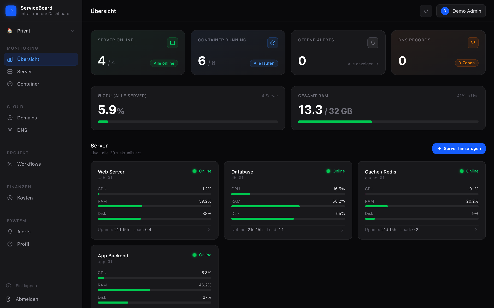
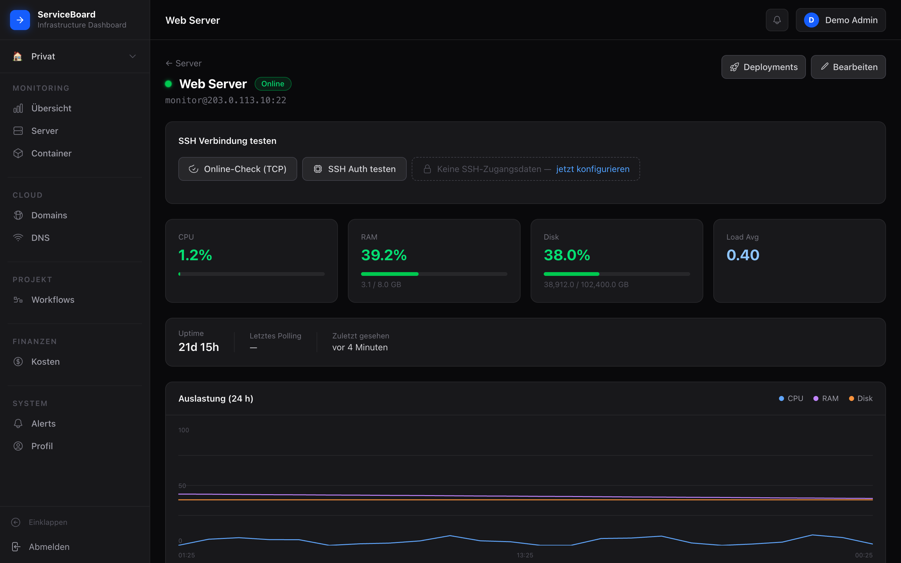
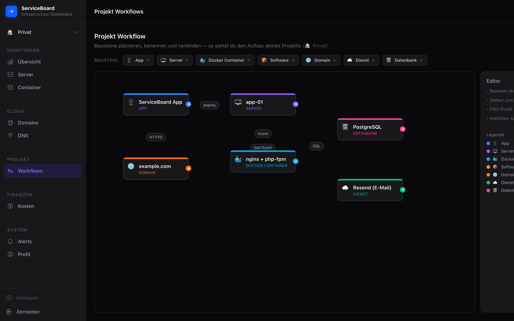
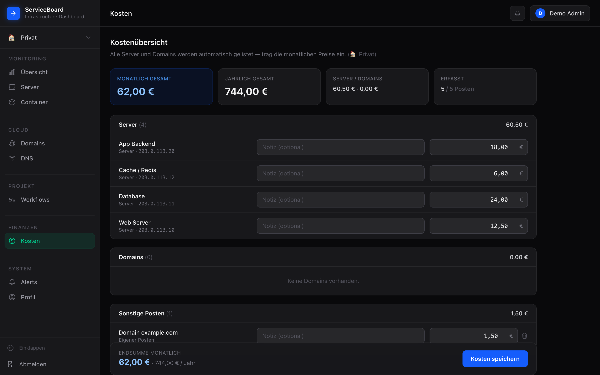

# ServiceBoard

> Self-hosted server & infrastructure monitoring dashboard built with Laravel 13, Tailwind CSS, and Alpine.js.

ServiceBoard monitors your servers over SSH (CPU, RAM, disk, load, uptime), manages Docker containers, services and deployments, maps your project architecture as a visual building-block canvas, and keeps an eye on costs — all in one clean dashboard with separate Personal and Business workspaces.

## Screenshots

> _The screenshots below use demo data (RFC 5737 example IPs)._

| Dashboard | Server detail |
|---|---|
|  |  |

| Project Workflows | Cost overview |
|---|---|
|  |  |

## Features

- **Server overview** — status, CPU, RAM, disk and uptime via SSH polling, including a 24-hour history chart
- **SSH connection test** — check reachability and authentication directly from the dashboard
- **Docker monitoring** — container status per server and a global overview
- **Services** — manage services per server, including HTTP/TCP health checks with status history and alerts
- **Deployments** — run git pull, a shell script or Docker Compose over SSH, with a live log
- **Project Workflows** — a visual building-block canvas: place, name and connect App, Server, Docker container, Software, Domain, Service and Database blocks to map how a project is wired together (per workspace)
- **Costs** — automatic cost overview across all servers and domains plus custom line items, monthly and yearly
- **Cloudflare integration** — DNS records and zone status
- **Alerts** — notifications (incl. Telegram) on outages or threshold breaches, with per-server CPU/RAM/disk thresholds
- **Workspaces** — separation between Personal (🏠) and Business (💼)

## Tech Stack

| Component | Version |
|---|---|
| PHP | 8.4 |
| Laravel | 13.x |
| MySQL | 8.4 |
| Redis | Alpine |
| Node.js | 22 |
| Tailwind CSS | 4.x |
| Alpine.js | 3.x |

## Local Development

```bash
cp .env.example .env
composer install
npm install

php artisan key:generate
php artisan migrate --seed

npm run dev
php artisan serve
```

## Deployment

Pushes to `main` are automatically rolled out to the production server via GitHub Actions (over SSH).

The pipeline runs the tests, audits dependencies for known vulnerabilities, builds the assets and deploys:

```
push → test (paratest) → build-assets → lint → static-analysis (Larastan) → dependency-audit → deploy
```

### Server requirements

- Docker and Docker Compose
- Node.js 22
- `.env` at `/root/serviceboard/.env` (`APP_ENV=production`, `APP_DEBUG=false`)
- GitHub secrets: `DEPLOY_HOST`, `DEPLOY_USER`, `DEPLOY_SSH_KEY`

## SSH Monitoring

ServiceBoard connects to the managed servers over SSH and runs a shell script that captures CPU, RAM, disk, load and uptime in a single pass.

Recommended setup: a dedicated, non-root `monitor` user with SSH key authentication. Docker metrics require membership in the `docker` group. SSH credentials are stored encrypted (`encrypted` cast) and are never returned in API responses.

## License

[MIT](LICENSE)
